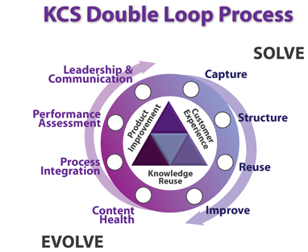

## Knowledge Centered Service (KCS)

KCS is a service delivery methodology that focuses on knowledge as a key asset of the organization implementing it. Development began in 1992 by the Consortium for Service Innovation, a non-profit alliance of support organizations.
 
 
 
 
 
###In a nutshell, KCS strives to:

1.Integrate the reuse, improvement, and (if it doesn’t exist) creation of knowledge into the problem solving process

2. Evolve content based on demand and usage

3. Develop a knowledge base of collective experience to date

4. Reward learning, collaboration, sharing, and improving

### Why KCS?

People choose to adopt KCS because they see a need to scale and extend their support capabilities, but do not have endless staffing or budget resources.  There are both quantifiable and qualitative benefits to adopting KCS.

**Enable Self-Service Strategy**

Improve customer success and use of self-help
Support center cost avoidance of up to 50%

[Ref](http://www.thekcsacademy.net/kcs/)
