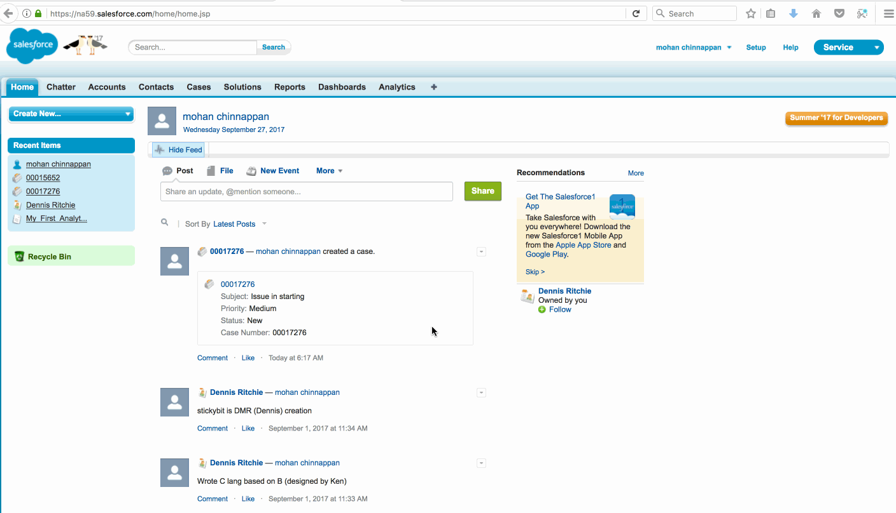

### How to use  Case Assignment Rules in Salesforce

#### Demo showing how to create a **Case Assignment Rule** and **Assign using active assignment rules** 

#### Resources

1. [Trailhead on Automate Case Management ](https://trailhead.salesforce.com/en/modules/service_basics/units/service_basics_automate_case_management)
2. [Permissions need for Managing Assignment Rules](https://help.salesforce.com/articleView?id=customize_leadrules.htm&type=0) 
3. [Knowledge Article on Set the 'Assign using active assignment rules' checkbox to 'true' on Case or Lead record creation only](https://help.salesforce.com/articleView?id=000205662&type=1)

